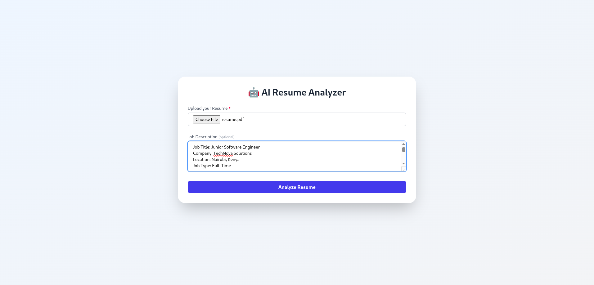
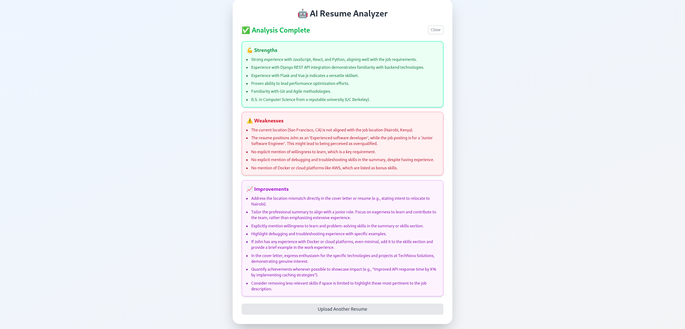

# AI Resume Website Analyzer

Welcome to the AI Resume Website Analyzer! This application helps job seekers optimize their resumes by providing intelligent analysis based on a given job description (optional). Upload your resume, and our AI will highlight **strengths**, identify **weaknesses**, and suggest **areas for improvement**.

---

## Table of Contents

* [Features](#features)
* [How It Works](#how-it-works)
* [Backend Repository](#backend-repository)
* [Frontend Setup](#frontend-setup)
    * [Prerequisites](#prerequisites-frontend)
    * [Screenshots](#screenshots)
    * [Installation](#installation-frontend)
    * [Running the Frontend](#running-the-frontend)
* [Usage](#usage)
* [Contributing](#contributing)
* [License](#license)

---

## Features

* **Resume Upload:** Easily upload your resume in various formats (e.g., PDF, DOCX).
* **Optional Job Description:** Provide a job description for more targeted and relevant analysis.
* **AI-Powered Analysis:** Leverages **Google Gemini** to understand your resume and job description content.
* **Strength Identification:** Pinpoints the strong aspects of your resume that align with best practices and the job description.
* **Weakness Detection:** Highlights areas where your resume might fall short or could be improved.
* **Improvement Suggestions:** Receives actionable recommendations to enhance your resume's effectiveness.

---

## How It Works

1.  **User Uploads:** You'll upload your resume and optionally a job description through the frontend.
2.  **API Call:** The frontend sends these files to the backend's `/api/resume-review/` endpoint.
3.  **AI Processing:** The backend (built with **Django** and running in **Docker**) utilizes **Google Gemini** to process both the resume and job description, extracting key information and performing a comparative analysis.
4.  **Analysis Generation:** The AI generates a comprehensive analysis, including identified strengths, weaknesses, and tailored suggestions for improvement.
5.  **Results Display:** The backend sends the analysis back to the frontend, which then presents it to you in an easy-to-understand format.

---

## Backend Repository

The core AI analysis and API services are handled by a separate backend application. You can find its repository here:

**[AI Resume Website Analyzer - Backend](https://github.com/bmuia/resume_reviewer_backend.git)**

This backend is built with **Django**, uses **Docker** for containerization, and integrates with **Google Gemini** for AI processing. Refer to its README for specific setup, configuration, and API endpoint details.

---

## Frontend Setup

This section details how to set up and run the frontend for the AI Resume Website Analyzer.

### Prerequisites (Frontend)

To run this frontend application locally, you'll need:

* **Node.js:** The latest LTS (Long Term Support) version is highly recommended.
* **npm** (Node Package Manager) or **Yarn:** For efficient management of project dependencies.

### Screenshots

Here's a glimpse of the application in action:




### Installation (Frontend)

1.  **Clone the repository:**
    ```bash
    git clone https://github.com/bmuia/resume_reviewer_frontend.git
    cd resume_reviewer_frontend 
    ```
2.  **Install dependencies:**
    ```bash
    npm install # or yarn install
    ```

### Running the Frontend

Once the dependencies are installed and configuration is set, you can start the development server:

```bash
npm start # or yarn start
```
---

### Usage
1. Ensure both the backend (running via Docker, as specified in its repository's README) and frontend servers are active.
2. Open your web browser and navigate to the frontend's URL (e.g., http://localhost:3000).
3. On the website, you will find an interface to:
  1. Upload your resume file.
  2. Occasionally upload a job description text.
4. Click the "Analyze" button.
5. Wait for the AI to process your resume.
6. The website will then display the analysis, including strengths, weaknesses, and actionable improvement suggestions.

---

### Contributing
We welcome contributions to improve the AI Resume Website Analyzer! Please follow these steps:

1. Fork the repository.
2. Create a new branch for your feature or bug fix: **git checkout -b feature/your-feature-name** or **bugfix/fix-something.**
3. Make your changes and ensure they adhere to the project's coding standards.
4. Write clear and concise commit messages.
5. Push your changes to your forked repository.
6. Open a Pull Request to the main branch of this repository, describing your changes in detail.

---
### License
This project is licensed under the [MIT License](LICENSE).